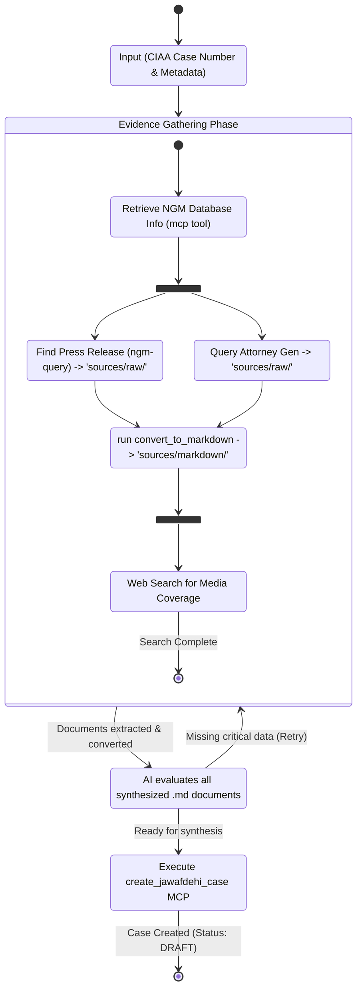

# Agentic Workflow Plan: Case Creation Pipeline

The goal is to automate the end-to-end creation of a draft corruption case in Jawafdehi. We start from a court case number and metadata. This pipeline involves orchestrating multiple tasks: retrieving judicial data, locating the CIAA press release alongside downloading the charge sheet, finding relevant news, and finally assembling the case draft.

All intermediate files and data gathering will be strictly organized within `casework/<CIAA case-number>/`:
- Raw downloads (PDFs, docs): `sources/raw/`
- Markdown conversions: `sources/markdown/`

## State Machine Visualization

Here is the updated Agentic Workflow represented as a State Machine.

## Agents vs. Skills vs. Workflows

In this meta-repo's architecture, we leverage a **Workflow** that composes multiple **Skills/MCP Tools**:
1. **Workflow**: The core orchestration logic lives in `.agents/workflows/create_jawafdehi_case.md`. 
2. **Skills / Extensible Extractors**: The workflow acts as the backbone. Over time, the list of parallel information extractors will expand modularly (e.g., adding extraction steps for **Bol Patras** and other government records).

## Proposed Changes

### 1. Create the Orchestration Workflow
Create the new file `.agents/workflows/create_jawafdehi_case.md` containing the step-by-step instructions.

**Steps in the Workflow:**
1. **[Initialize]**: Setup the casework directories:
   - `casework/<CIAA case-number>/sources/raw/`
   - `casework/<CIAA case-number>/sources/markdown/`
2. **[FetchJudicialData]**: Execute a database query via `mcp_jawafdehi_ngm_query_judicial` to pull the core facts for the case number.
3. **[Parallel Extraction]**: Launch independent parallel branches for data gathering:
   - **[FetchCIAA]**: Use the `ngm-query` skill/tool to locate the CIAA press release (saving to `sources/raw`).
   - **[FetchChargeSheet]**: Retrieve the Abhiyog Patra using mapping logic and Attorney General API (saving to `sources/raw`).
   - *(Note: Future extractors like Bol Patras will be added as parallel branches here).*
4. **[Convert to Markdown]**: After **every file download**, the Jawafdehi `convert_to_markdown` MCP tool is called to convert the raw file into an accessible `.md` file inside the `sources/markdown/` directory.
5. **[FetchNews]**: Wait for the parallel documents to finish downloading and converting, then search for news articles sequentially.
6. **[DraftCase]**: Pass the compiled context to the existing `jawafdehi-caseworker` tools to generate the final DRAFT case.

### 2. Extend MCP Tools / Scripts
Rather than writing messy manual shell commands, extend the `jawafdehi-mcp` service if necessary:
- **`mcp_jawafdehi_fetch_ag_charge_sheet`**: Create an MCP tool that calculates the Nepali month, hits the AG API, downloads the document, and runs Likhit over it.

## User Review Required

> [!TIP]
> Architecture Updates:
> The casework is now strictly partitioned between `sources/raw` and `sources/markdown`!
>
> Is the plan fully finalized? If you agree, please give me the formal go ahead and I will generate the workflow markdown file.

## Verification Plan

### Manual Verification
1. Mock the required metadata for Special Court case `081-CR-0123`.
2. Step through the newly created workflow steps iteratively.
3. Verify that evidence files are successfully gathered in the `casework/081-CR-0123/sources/raw` and `casework/081-CR-0123/sources/markdown` directories.
4. Verify all downloaded files were successfully converted to markdown.
5. Verify that a draft case appears in the Jawafdehi platform with accurate evidence citing.
