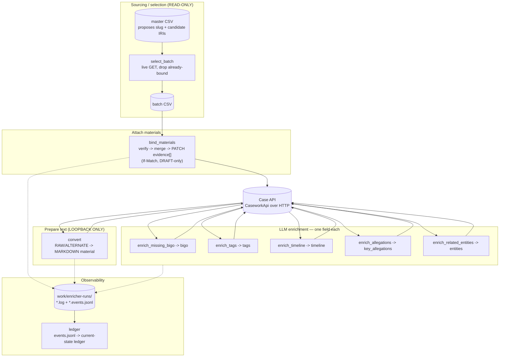
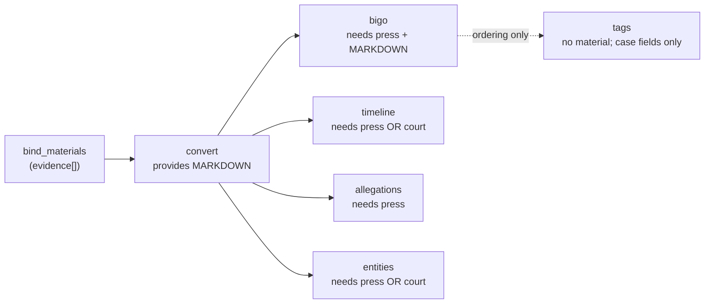

# `casework/` — CIAA case enrichment pipeline

A reusable, API-driven pipeline that sources supporting materials, converts them
to text, and enriches CIAA Special-Court cases with LLM-extracted fields. Ported
out of five standalone Django management commands into one installed package so
the stages can share auth, selection, LLM routing, run-logging, and a
prerequisite DAG instead of each re-deriving them.

Every stage talks to the case API over HTTP (`CaseworkApi`) — **no stage touches
the database directly.**

---

## ⚠️ Read this before you run anything

1. **Dry-run is the default.** A bare invocation is **read-only**: it prints the
   exact write it *would* send and exits. You must pass **`--apply`** to write.
   (This deliberately inverts the donor management commands, which wrote unless
   you passed `--dry-run`.)
2. **Writing to a non-loopback host needs three things at once:** `--apply`
   **and** `--allow-remote-writes` **and** a Bearer `--api-token`. Miss any one
   and the client refuses the PATCH. Reads are never gated.
3. **`convert` is loopback-only, by design.** It refuses *any* non-`127.0.0.1` /
   `localhost` base URL (`convert.py:180`) — there is **no** remote-write escape
   for it, because it uploads hundreds of materials. Run it against a local
   mirror, never against production.
4. **Each enricher writes exactly one field.** Blast radius is one JSON field per
   case per stage (see the field-ownership table). Re-running is safe: an
   already-enriched case is skipped, not double-written.

---

## Architecture



### Shared layer (`casework/common/`)

| Module | Responsibility |
|--------|----------------|
| `api.py` | `CaseworkApi` — the only HTTP client. Bearer or Basic auth; **write-guard** refuses non-loopback PATCH unless `allow_remote_writes=True`. |
| `cli.py` | Shared argparse (`add_common_args`), run-logging (`configure_run_logging`, `log_event`, run header/footer), `basic_auth_from_env`. |
| `llm.py` | `bootstrap(provider, model, dev)` — routes each stage through its premium/cheap LLM **tier**. |
| `pipeline.py` | The **stage DAG** (`STAGES`) + `unmet_prerequisites` — the single source of "what depends on what" and "why a stage did *not* run". |
| `select.py` | Case selection: `select_for_run` (the one path every enricher uses), the `--batch-csv` allowlist loader, fiscal-year and state gates. |
| `materials.py` | Material existence probes, `source_text`, MARKDOWN-role helpers. |
| `parse.py` | Robust, string-aware JSON extraction from LLM output. |
| `titles.py` | Case-title / court-context helpers. |

---

## Design

### The prerequisite DAG

`convert` gates the four stages that read material — `bigo`, `timeline`,
`allegations`, `entities`. A case with evidence bound but no MARKDOWN-role
material cannot be enriched, and that is reported as an **explicit unmet
prerequisite**, never as a silent skip that looks like "already done".

`tags` is the exception: it reads no material at all, so `convert` does not gate
it (see the bullet below the diagram).



- **`tags` gates on `bigo` for ordering only** — it reads no material and the
  donor tags cases fine with an unknown amount, so a hard material gate would
  skip cases the donor does not skip.
- **`timeline` / `entities` accept press *or* court** content — gating on press
  alone would strand court-order-only cases.

### Field ownership & write targets

| Stage | Module (`python -m casework.…`) | Writes | Endpoint | Remote write? | LLM tier |
|-------|--------------------------------|--------|----------|---------------|----------|
| select | `select_batch` | batch CSV (local file) | GET only | **read-only** | — |
| bind | `bind_materials` | `evidence[]` | `PATCH /evidence` (If-Match) | yes ¹ | — |
| convert | `convert` | MARKDOWN material | `POST /api/materials/<s>/<i>/file` | **loopback only** | — |
| bigo | `enrich_missing_bigo` | `bigo` | `patch_field` | yes ¹ | premium |
| tags | `enrich_tags` | `tags` | `patch_field` | yes ¹ | cheap |
| timeline | `enrich_timeline` | `timeline` | `patch_field` | yes ¹ | premium |
| allegations | `enrich_allegations` | `key_allegations` | `patch_field` | yes ¹ | premium |
| entities | `enrich_related_entities` | `entities` (+ NES entities with `--create-entities`) | `patch_field`, `POST /api/entities` | yes ¹ | premium |
| court_record | `enrich_court_record` | `trial_start_date`, `trial_end_date`, `entities` (accused) (+ NES person entities) | `patch_case`, `POST /api/entities` | yes ¹ | — (no LLM) |
| ledger | `ledger` | ledger JSON (local file) | none (reads run logs) | local file | — |

¹ Remote write requires **`--apply` + `--allow-remote-writes` + `--api-token`** together.

### Auth matrix

| Target | Auth | How |
|--------|------|-----|
| Remote / production API | Bearer token | `--api-token …` or `JAWAFDEHI_API_TOKEN` |
| Local DEV_AUTH (loopback) | HTTP Basic | `CASEWORK_API_USER` + `CASEWORK_API_PASSWORD` |

There is deliberately **no baked-in dev credential fallback** — a missing
credential fails loud rather than silently authenticating as a dev account.

### Run logging & the ledger loop

Each run gets a `run_id` and writes two files under `work/enricher-runs/`
(override with `CASEWORK_RUN_LOG_DIR`):

- `…-<stage>-<run_id>.log` — human-readable, UTC-timestamped
- `…-<stage>-<run_id>.events.jsonl` — one JSON event per case/step

`enrich_related_entities` writes five more, sharing that stem. The first two are the
answer to "what did the model actually find", which the counts in the log do not give
you — they survive a run that binds nothing:

| File | Holds |
|------|-------|
| `.extracted.jsonl` | Every extracted name with its section and notes, per case |
| `.accused_notes.jsonl` | The `accused_notes` array |
| `.binds.jsonl` | Each bind, with the candidates that lost |
| `.created.jsonl` | Each entity created or refused, with the reason |
| `.nomatch.md` | Names still unmatched, grouped, with a Role column |

`ledger.py` folds all `*.events.jsonl` into a **current-state ledger** keyed by
`(slug, stage)`, latest-by-timestamp, ignoring non-outcome statuses
(`ok`/`start`/`fallback`/`none`/`planned`). That is how you answer "what is the
enrichment state of every case right now" without re-reading the API.

---

## Adding a new stage

Start with one question: **does your stage write `evidence` or `entities`?**
Those two are whole-list replaces and will delete data if you get them wrong.
Everything else is a plain field write and is safe.

### Writing a plain field — `bigo`, `tags`, a new `verdict`

Use `patch_field`. It sends one op naming one path, and the server rewrites
nothing else (`cases/api_views.py:940` gates every relation on whether the patch
actually names it).

```python
case, etag = api.get_case_with_etag(slug)
api.patch_field(slug, "verdict", "ACQUITTED", if_match=etag)
```

Nothing else on the case changes — verified: each of the five enrichers was run
against a bound case and left its `evidence` rows and their notes untouched.

### Writing `evidence` or `entities` — read, merge, send the whole list

`PATCH /evidence` **replaces the entire list.** The server deletes every existing
row and recreates from exactly what you send (`cases.api_views._write_material_references`).
Send only your new document and you delete the press release and court order
someone bound last month.

Never send a delta. Read the case, merge into what is already there, send it all:

```python
from casework.common.evidence import current_evidence, merge_evidence

case, etag = api.get_case_with_etag(slug)
# (material_iri, note) pairs. Pass "" when the stage has no note to bind yet.
merged = merge_evidence(current_evidence(case), [(new_iri, "")])
api.replace_list(slug, "evidence", merged, if_match=etag)
```

`merge_evidence` de-duplicates and preserves both the order and the
`additional_details` note of every row already on the case.

### A news enricher, concretely

News is the obvious next stage, and it is an `evidence` writer — so it lands in
the dangerous category above. Every published case carries news: sampling 40 of
them gives `news` on **40/40**, alongside `press_release` (14), `court_order`
(10), `legal_corpus` (7), `charge_sheet` (5), `document` (2), `official_report`
(1) and `social_media` (1). Three to eight documents per case is normal.

So a news stage runs on cases that already hold a press release and a court
order, and must add to that list rather than become it. Two options, in
preference order:

1. **Reuse `bind_materials`.** Emit a batch CSV with a news-IRI column and add
   that column name to `DEFAULT_MATERIAL_COLUMNS`. You inherit the merge, the
   existence probe, the DRAFT gate, the `If-Match`, and the abort-on-uncertain
   behaviour for free. This is how `abhiyog_ag_iri` already works.
2. **Write a stage that calls `replace_list` directly.** Only if the search for
   candidate articles has to happen inside the stage. Then you own the merge, and
   you must follow the pattern above exactly.

### Register the stage — only if it writes a case field

`STAGES` in `common/pipeline.py` holds the six LLM/convert stages. `provides`
names the **case field** a stage fills (`bigo`, `tags`, `timeline`,
`key_allegations`, `entities`) or the literal `MARKDOWN` role. It feeds the
"already done, skip it" check.

A stage that only attaches documents does **not** belong here — `bind_materials`
is deliberately absent from the registry, because it fills no case field. So a
news *binder* is registered nowhere; it is a sibling of `bind_materials`.

Register only if you write a case field. A stage that reads news articles to fill
one looks like this:

```python
"press_summary": Stage(
    "press_summary", provides=("short_description",),
    requires_materials=("news",),
    requires_stages=("convert",),      # news must be MARKDOWN before it is read
),
```

Only list what your stage actually writes. A phantom `provides` entry makes cases
look complete that you never touched.

### Before you call it done

- `--dry-run` defaults to **on**; `--apply` opts in. Get this from
  `add_common_args`, do not re-implement it.
- Pass `if_match=etag` on every **case PATCH** — `patch_field` and
  `replace_list`. Without it a concurrent edit is silently overwritten instead
  of failing with 412. Material uploads (`convert.py`'s MARKDOWN POST) go
  through `_request` directly and have no case ETag to send; they are covered by
  the loopback write-guard instead.
- A remote `--api-base-url` must be `https`. `CaseworkApi` refuses to construct
  otherwise, because the `Authorization` header goes on every request and these
  runs last hours. Loopback over `http` is exempt — a local DEV_AUTH server has
  no TLS and the token never leaves the host.
- Read the token from `$JAWAFDEHI_API_TOKEN` rather than `--api-token`. A token
  passed on the command line sits in `/proc/<pid>/cmdline` (mode 444) for the
  whole run and is readable by every local user via `ps -af`; the environment
  lands in `/proc/<pid>/environ` (mode 400), which is not.
- One stage writes one field. Keeps the blast radius to a single JSON field.
- If the stage writes `evidence` or `entities`, add a test that binds a case,
  runs your stage, and asserts the pre-existing rows survive with their notes.

---

## Running the scripts

### Environment

```bash
uv sync                                   # base install
uv sync --extra bigo-enrichment           # + markitdown/likhit, required ONLY for `convert`

# Target + auth (pick per target):
export JAWAFDEHI_API_BASE="http://127.0.0.1:48010"     # local DEV_AUTH server
# remote instead:  export JAWAFDEHI_API_BASE="https://api.jawafdehi.org"
export JAWAFDEHI_API_TOKEN="…"            # Bearer, for remote writes
export CASEWORK_API_USER="…"              # Basic, for loopback DEV_AUTH
export CASEWORK_API_PASSWORD="…"
```

> All commands below assume `JAWAFDEHI_API_BASE` is set. Pass `--api-base-url`
> explicitly to override it per-run. Add `--verbose` for DEBUG logging,
> `--limit N` to cap cases, `--slug <slug>` (repeatable) to target specific cases.

### Common flags (`add_common_args`)

`--slug` · `--court-case` · `--batch-csv` · `--limit` · `--fiscal-year` ·
`--force` · `--dry-run` (default) · `--apply` · `--provider` (default
`claude_cli`) · `--model` · `--api-base-url` · `--api-token` ·
`--allow-remote-writes` · `--verbose`

#### Restricting a run to a batch — `--batch-csv`

Every enricher takes the same batch CSV `bind_materials` does: a `slug` column,
extra columns ignored. So a `select_batch` output feeds straight into enrichment.

```bash
# Only the 238 slugs in this file are touched — the first 10 rows of it
uv run python -m casework.enrich_missing_bigo \
    --batch-csv work/2026-08-03-Dry-run-bigo-enricher/batch-238.csv \
    --limit 10 --verbose
```

It is a hard allowlist. No case outside the file is selected, results come back
in file order so `--limit N` means the file's first N rows, and `--slug` or
`--fiscal-year` alongside it can only narrow the set further.

Two behaviours worth knowing:

- A batch **still passes the DRAFT/IN_REVIEW state gate**, unlike `--slug`,
  which bypasses it. A stale row for a case that has since been PUBLISHED is
  skipped rather than re-enriched. Use `--slug` when you mean to override.
- A missing file, a missing `slug` column, or a file with no slugs **exits
  immediately**. An empty allowlist would otherwise fall through to bulk
  selection and enrich every enrichable case.

---

### 0. Select the next batch — `select_batch` (read-only)

```bash
# READ-ONLY: GETs only, writes a local batch CSV. No --apply.
uv run python -m casework.select_batch \
    --master-csv master.csv --out batch2.csv \
    --year 078 --year 079 --limit 50
```

### 1. Bind materials — `bind_materials`

```bash
# DRY-RUN (default): print the exact PATCH it would send
uv run python -m casework.bind_materials --batch-csv batch2.csv --dry-run

# APPLY (loopback)
uv run python -m casework.bind_materials --batch-csv batch2.csv --apply

# APPLY (remote / production)
uv run python -m casework.bind_materials --batch-csv batch2.csv \
    --api-base-url https://api.jawafdehi.org --api-token "$JAWAFDEHI_API_TOKEN" \
    --apply --allow-remote-writes
```

### 2. Convert RAW → MARKDOWN — `convert` (loopback only)

```bash
# DRY-RUN
uv run python -m casework.convert --dry-run

# APPLY — LOOPBACK ONLY; refuses any non-127.0.0.1/localhost host
uv run python -m casework.convert --slug case-0123 --apply
```

### 3. Enrich fields (run per stage)

Each takes the same dry-run/apply/remote pattern. Shown for `bigo`; the others
are identical apart from the module name.

```bash
# DRY-RUN
uv run python -m casework.enrich_missing_bigo --dry-run

# APPLY (loopback)
uv run python -m casework.enrich_missing_bigo --apply

# APPLY (remote / production)
uv run python -m casework.enrich_missing_bigo \
    --api-base-url https://api.jawafdehi.org --api-token "$JAWAFDEHI_API_TOKEN" \
    --apply --allow-remote-writes
```

| Stage | Dry-run | Apply (loopback) |
|-------|---------|------------------|
| bigo | `uv run python -m casework.enrich_missing_bigo --dry-run` | `… --apply` |
| tags | `uv run python -m casework.enrich_tags --dry-run` | `… --apply` (add `--no-llm` for rules-only) |
| timeline | `uv run python -m casework.enrich_timeline --dry-run` | `… --apply` |
| allegations | `uv run python -m casework.enrich_allegations --dry-run` | `… --apply` |
| entities | `uv run python -m casework.enrich_related_entities --dry-run` | `… --apply` (add `--create-entities` to create missing NES entities) |

For every "Apply (loopback)" cell above, the **remote/production** form adds:
`--api-base-url https://api.jawafdehi.org --api-token "$JAWAFDEHI_API_TOKEN" --allow-remote-writes`.

#### Creating the NES entities a case needs — `--create-entities`

`enrich_related_entities` binds extracted names to NES entities that already exist.
Most do not: production run `645b1483` (case 078-CR-0038) extracted 13 names and
matched **none**, because NES holds almost no institution a CIAA court order names.

`--create-entities` creates them, then binds them. It is **off by default and
never implied by `--apply`**, so upgrading the enricher cannot make an existing
`--apply` run start writing to NES. It does not override the dry run either —
without `--apply` the flag only reports what it would create.

```bash
# Dry run: reports every entity it would create, creates nothing
uv run python -m casework.enrich_related_entities \
    --slug case-078-cr-0038-ciaa-special-court-case-078-cr-9a \
    --create-entities --dry-run

# Write to production. --allow-remote-writes is only the guard; the write still
# needs somewhere to go and something to authenticate with
uv run python -m casework.enrich_related_entities --batch-csv batch.csv \
    --create-entities --apply \
    --api-base-url https://api.jawafdehi.org \
    --api-token "$JAWAFDEHI_API_TOKEN" --allow-remote-writes
```

Read `*.created.jsonl` before an apply. Its `outcome` column is the whole story:

| Outcome | Meaning |
|---------|---------|
| `created` | The POST succeeded and the entity is bound to the case |
| `would-create` | Dry run: eligible to create, but nothing was POSTed and nothing bound. An `--apply` run would create it |
| `already-exists` | Someone got there first (409); bound to theirs |
| `reused` | A name created earlier in this run under the same prefix |
| `skipped` | One of the four gates below refused it; the `reason` column says which |
| `error` | The POST failed; the name stays unmatched, the case keeps its other binds |

#### What is allowed to become an entity

Four gates run in front of every POST, cheapest and most categorical first. A refused
name still **binds** whatever it matched — these gate creation only.

| Gate | Refuses |
|------|---------|
| Section | Anything from the `location` section. NES already holds all 77 districts under official codes (`location/district/jhapa-np0104`), so a location created here is always a duplicate or junk |
| Name shape | `_name_vetoes`: a composite `Activity - Location`, a lone token, an all-generic institution name |
| `is_named_entity` | Anything the extraction did not confirm names one specific thing. A **missing** field refuses too |
| Identity | No prefix, a prefix whose parent branch does not exist, or no slug |

`is_named_entity` fails closed on purpose. A prompt regression that drops the field shows
up as `0 created` in the summary, which is visible and fixable; defaulting the other way
fills NES with entries nobody can delete.

Three things to know before you run it:

- **Entities are created with no sources.** `POST /api/entities` validates `@id`,
  `@type` and `name` and nothing else; the 2-distinct-publisher rule lives in
  `manage.py bulk_ingest`. Each entity carries a `citation` naming the document it
  came from, which is one source, not two.
- **An already-enriched case creates nothing.** The idempotency gate skips any case
  already holding a `related` bind, before the create step runs. Use `--force`.
- **The slug comes from the English name when there is one.** Most firms in these court
  orders are English names written in Devanagari, and transliterating them back gives
  `phareshta-debhalapamenta-enda-indashtrija` for "Forest Development and Industries".
  The IRI is permanent, so `created.jsonl` carries a `name_en` column worth reading
  before an apply.

### 4. Consolidate run logs — `ledger`

```bash
# Fold every events.jsonl in the run-log dir into a current-state ledger
uv run python -m casework.ledger

# Scope it, or inspect without writing
uv run python -m casework.ledger --stage bigo --stage tags --status ok
uv run python -m casework.ledger --no-write        # print only, don't write ledger file
```

---

## End-to-end production runbook

Ordered, dependency-respecting sequence for one batch. **Dry-run each step, read
the summary, then re-run with `--apply`.**

```bash
# 1. Select — read-only
uv run python -m casework.select_batch --master-csv master.csv --out batch.csv --year 078 --limit 50

# 2. Bind evidence  (dry-run -> apply)
uv run python -m casework.bind_materials --batch-csv batch.csv --dry-run
uv run python -m casework.bind_materials --batch-csv batch.csv --api-token "$JAWAFDEHI_API_TOKEN" --apply --allow-remote-writes

# 3. Convert to MARKDOWN  (LOOPBACK mirror only)
uv run python -m casework.convert --batch-csv batch.csv --dry-run
uv run python -m casework.convert --batch-csv batch.csv --apply

# 4. Enrich — bigo first (tags orders after it), then the rest.
#    --batch-csv on EVERY stage: without it each one selects the whole corpus
#    (~3,000 enrichable cases), not the 50 you just bound.
for stage in enrich_missing_bigo enrich_tags enrich_timeline enrich_allegations enrich_related_entities; do
  uv run python -m casework.$stage --batch-csv batch.csv --dry-run
  uv run python -m casework.$stage --batch-csv batch.csv --api-token "$JAWAFDEHI_API_TOKEN" --apply --allow-remote-writes
done

# 5. Consolidate the run into a state ledger
uv run python -m casework.ledger
```

### Preflight checklist before `--apply`

- [ ] `JAWAFDEHI_API_BASE` points where you think it does (`echo` it).
- [ ] Dry-run output shows the expected case count and the exact field/value.
- [ ] For remote: `--api-token` set **and** `--allow-remote-writes` present.
- [ ] `convert` is running against loopback (it will refuse otherwise).
- [ ] You have the run-log dir (`work/enricher-runs/`) writable.

---

## Troubleshooting

| Symptom | Cause | Fix |
|---------|-------|-----|
| `refusing … non-loopback` on write | Remote PATCH without the gate | Add `--allow-remote-writes` (and `--api-token`). |
| `convert … refusing to upload` | `convert` pointed at a non-loopback host | Point it at `127.0.0.1`; convert never writes remote. |
| HTTP **412** on bind | Case changed between read and write (If-Match) | Re-select and re-bind; the guard prevented a clobber. |
| HTTP **422** on timeline, whole PATCH lost | One malformed `date_bs` fails the server's `^\d{4}-\d{2}-\d{2}$` | Already mitigated: bad `date_bs` is coerced, else that field is dropped. Check the event log for the offending case. |
| Case **skipped**, not enriched | Unmet prerequisite (no MARKDOWN) or already enriched | Run `convert` first; check the run log — the reason is explicit. |
| Bind **aborts** a case | A candidate material was "uncertain" (not a clean 200/absent) | Intentional: never a partial write. Resolve the material, re-run. |
| `API credentials required` | No `--api-token` and no `CASEWORK_API_USER/PASSWORD` | Set the auth for your target (see Auth matrix). |

---

## Testing

```bash
DEBUG=True uv run pytest tests/casework/         # full casework suite
DEBUG=True uv run ruff check casework/           # lint
```
